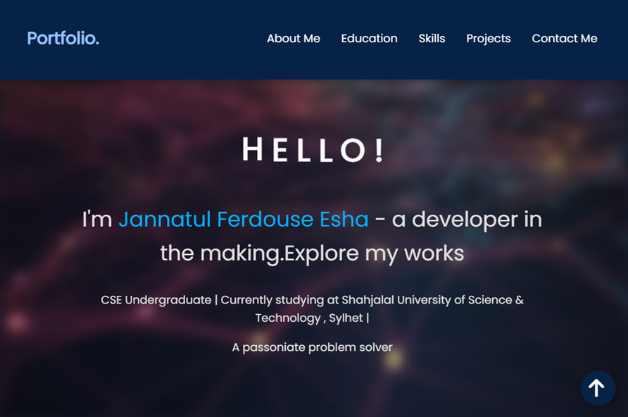
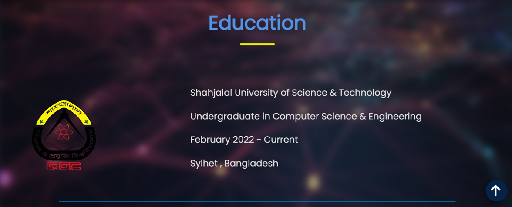
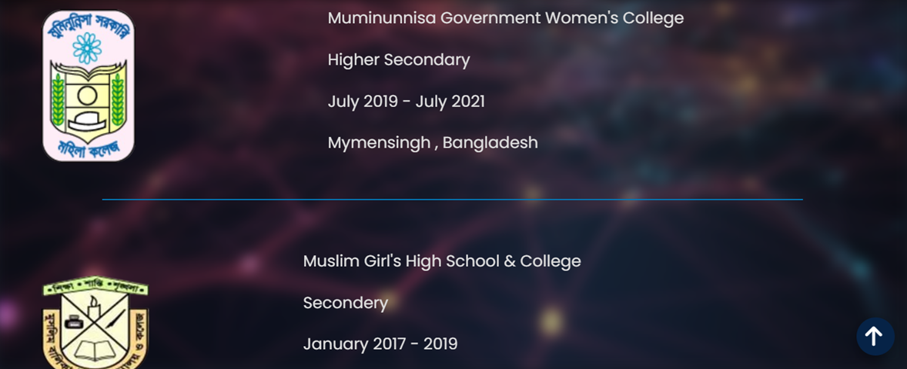
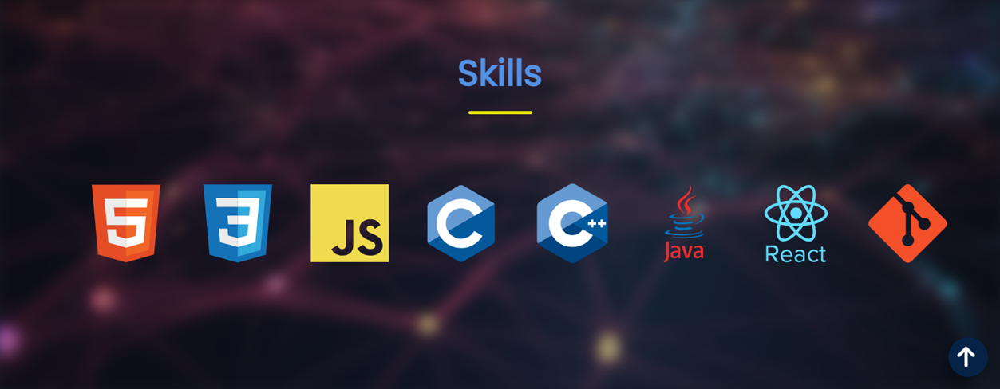
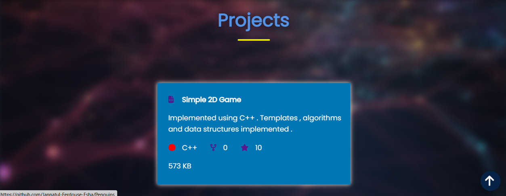
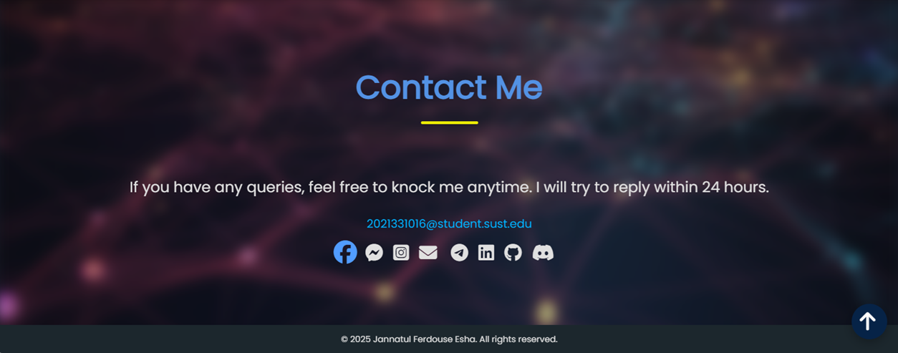

# Simple Portfolio Website

Welcome to my personal portfolio website! This project provides a brief overview of my work, skills, and educational qualifications.

## 🚀 Live Demo

You can view the live portfolio here: [https://jannatul-ferdouse-esha.github.io/Simple-Portfolio-/](https://jannatul-ferdouse-esha.github.io/Simple-Portfolio-/)

## ✨ Features

* **Navigation Bar:**
    * Includes links for `About Me`, `Education`, `Skills`, `Projects`, and `Contact Me` sections.
    * Features "Portfolio." title on the right side.
    * The navigation bar remains sticky at the top of the screen when scrolling.
    * Clicking on links provides smooth scrolling to the specific sections on the same page.

### Visual Overview of Features:

---

### About Me Section

[](https://jannatul-ferdouse-esha.github.io/Simple-Portfolio-/#about)
Click the image  below to view the  About Me section: 

* A personal introduction starting with "Hello! I'm Jannatul Ferdouse Esha".
* Highlights your academic status (3rd year CSE undergraduate student at Shahjalal University of Science and Technology).

---

### Education Section

[](https://jannatul-ferdouse-esha.github.io/Simple-Portfolio-/#education)
[](https://jannatul-ferdouse-esha.github.io/Simple-Portfolio-/#education)
Click the images  below to view the Education section: 

* Details for three educational institutions: Shahjalal University of Science and Technology, Muminunnisa Government Women's College, and a placeholder for a school.
* Each item features a logo on the left and details like institution name, year, and location on the right.

---

### Skills Section

[](https://jannatul-ferdouse-esha.github.io/Simple-Portfolio-/#skills)
Click the image  below to view the Contact Me section: 

* Displays your programming language and frontend skills (C, C++, JavaScript, HTML, CSS, Git, Pandas) with corresponding logos.
* Logos become colored and slightly enlarge on hover.

---

### Projects Section

[](https://jannatul-ferdouse-esha.github.io/Simple-Portfolio-/#projects)
Click the image  below to view the  Contact Me section:

* A project box for your GitHub profile.
* The box expands on hover and directs to your GitHub profile upon clicking.

---

### Contact Me Section

[](https://jannatul-ferdouse-esha.github.io/Simple-Portfolio-/#contact)
Click the image  below to view the Contact Me section:

* A message indicating 24-hour availability for contact and your email address.
* Includes icons for various social media platforms like Facebook, Messenger, Instagram, GitHub, and LinkedIn.

---

* **Blurry Background:**
    * An attractive blurry background image is set for the entire page, which helps highlight the content.

* **Back to Top Button:**
    * A fixed button at the bottom right corner of the page that scrolls the page to the very top when clicked.

* **Footer:**
    * A simple footer with copyright information.

## 🛠️ Technologies Used

* **HTML5:** For structuring the website.
* **CSS3:** For styling and responsive design.
* **Font Awesome:** For using icons.
* **Google Fonts (Poppins):** For font styling.

## 🚀 How to Run the Project

To run this project on your local machine, follow these steps:

1.  **Clone the repository:**
    ```bash
    git clone [https://github.com/Jannatul-Ferdouse-Esha/Simple-Portfolio-.git](https://github.com/Jannatul-Ferdouse-Esha/Simple-Portfolio-.git)
    ```
2.  **Navigate to the directory:**
    ```bash
    cd Simple-Portfolio-
    ```
3.  **Open in browser:**
    Locate the `index.html` file in your file explorer and open it with your preferred web browser.

## ✉️ Contact

If you have any questions or wish to get in touch, please feel free to contact me:

* **Email:** `2021331016@student.sust.edu`
* **GitHub:** [Jannatul-Ferdouse-Esha](https://github.com/Jannatul-Ferdouse-Esha)
* **LinkedIn** 
* **Facebook** 
* **Instagram**

---

© 2025 Jannatul Ferdouse Esha. All rights reserved.
